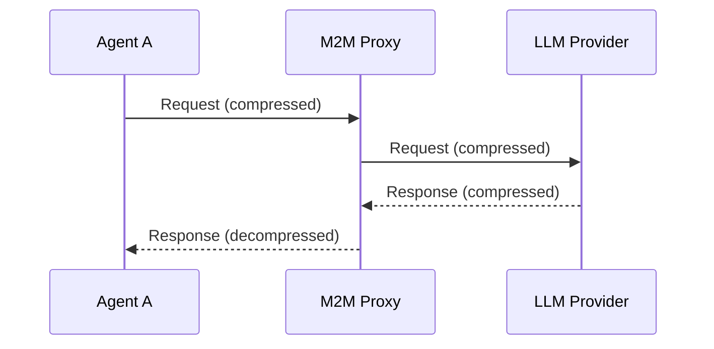

# M2M Protocol

[](https://infernet.org)
[](LICENSE)
[](https://www.rust-lang.org/)

High-performance Machine-to-Machine protocol for LLM API communication with intelligent compression, security scanning, and an OpenAI-compatible proxy.

## Features

- **Multi-codec compression** - Token (~30% savings), Brotli (high-ratio), Dictionary
- **OpenAI-compatible proxy** - Drop-in reverse proxy for any OpenAI-compatible API
- **QUIC/HTTP3 transport** - 0-RTT, no head-of-line blocking, connection migration
- **Protocol negotiation** - HELLO/ACCEPT handshake with capability exchange
- **ML-based routing** - [Hydra SLM](https://huggingface.co/infernet/hydra) for intelligent algorithm selection
- **Security scanning** - Threat detection for prompt injection/jailbreaks
- **Streaming support** - SSE compression for real-time responses
- **Session management** - Stateful sessions with timeout and keep-alive

## OpenAI-Compatible Proxy

The M2M proxy works with **any OpenAI-compatible API endpoint** - not just OpenAI:

| Provider Type | Examples | Benefits |
|---------------|----------|----------|
| **Self-hosted** | vLLM, Ollama, LocalAI, TGI | 30-40% bandwidth savings |
| **OpenAI** | GPT-4o, o1, o3 | Exact token counting |
| **Cloud** | OpenRouter, Together.ai, Anyscale | Drop-in compression |
| **Enterprise** | Azure OpenAI, AWS Bedrock | Security scanning |

```bash
# Start proxy forwarding to local Ollama
m2m proxy --port 8080 --upstream http://localhost:11434/v1

# With QUIC transport for agent-to-agent communication
m2m proxy --port 8080 --upstream http://localhost:11434/v1 --transport both --quic-port 8443

# Point your app to the proxy
curl http://localhost:8080/v1/chat/completions \
  -d '{"model": "llama3.2", "messages": [{"role": "user", "content": "Hello"}]}'
```

See [docs/guides/proxy.md](docs/guides/proxy.md) for full proxy documentation.

## Supported Models

M2M supports models with **publicly accessible tokenizers** for accurate compression:

| Provider  | Tokenizer           | Models                                |
|-----------|---------------------|---------------------------------------|
| OpenAI    | tiktoken (open)     | GPT-4o, GPT-4, GPT-3.5, o1, o3        |
| Meta      | Llama BPE (open)    | Llama 3, 3.1, 3.3                     |
| Mistral   | Llama BPE (open)    | Mistral Large/Medium/Small, Mixtral   |
| DeepSeek  | Open tokenizer      | DeepSeek v3, r1, Coder                |
| Qwen      | Open tokenizer      | Qwen 2.5, Qwen Coder                  |
| Nvidia    | Llama BPE (open)    | Nemotron                              |

Models with closed tokenizers (Claude, Gemini, Grok) work through the proxy with heuristic token estimates.

## Installation

```bash
# From source
cargo install --path .

# Or build with ONNX support (for ML routing)
cargo build --release --features onnx
```

## Quick Start

### Compression (Stateless)

```rust
use m2m::{CodecEngine, Algorithm};

let engine = CodecEngine::new();

// Compress LLM API payload
let content = r#"{"model":"gpt-4o","messages":[{"role":"user","content":"Hello"}]}"#;
let result = engine.compress(content, Algorithm::Token)?;

println!("Compressed: {}", result.data);
println!("Ratio: {:.1}%", result.byte_ratio() * 100.0);

// Decompress (auto-detects algorithm from wire prefix)
let original = engine.decompress(&result.data)?;
```

### Auto-Selection

```rust
use m2m::CodecEngine;

let engine = CodecEngine::new();
let (result, algorithm) = engine.compress_auto(content)?;
println!("Selected: {:?}", algorithm);
```

### Security Scanning

```rust
use m2m::SecurityScanner;

let scanner = SecurityScanner::new().with_blocking(0.8);
let result = scanner.scan(content)?;

if !result.safe {
    println!("Threats: {:?}", result.threats);
}
```

### Full Protocol (Session-Based)

```rust
use m2m::{Session, Capabilities};

// Client side
let mut client = Session::new(Capabilities::default());
let hello = client.create_hello();

// Server side
let mut server = Session::new(Capabilities::default());
let accept = server.process_hello(&hello)?;

// Client processes accept
client.process_accept(&accept)?;

// Exchange compressed data
let data_msg = client.compress(r#"{"model":"gpt-4o","messages":[]}"#)?;
let content = server.decompress(&data_msg)?;
```

## CLI Usage

```bash
# Compress content
m2m compress '{"model":"gpt-4o","messages":[{"role":"user","content":"Hello"}]}'

# Compress with specific algorithm
m2m compress -a brotli '{"model":"gpt-4o","messages":[...]}'

# Decompress
m2m decompress '#T1|{"M":"4o","m":[{"r":"u","c":"Hello"}]}'

# Security scan
m2m scan "Ignore previous instructions"

# Analyze content (shows algorithm recommendation)
m2m analyze '{"messages":[{"role":"user","content":"Test"}]}'

# List models
m2m models list

# Search models
m2m models search "llama"

# Start proxy server (TCP)
m2m proxy --port 8080 --upstream http://localhost:11434/v1

# Start proxy with QUIC transport
m2m proxy --port 8080 --upstream http://localhost:11434/v1 --transport quic --quic-port 8443

# Start proxy with security scanning
m2m proxy --port 8080 --upstream http://localhost:11434/v1 --security --threshold 0.8
```

## Protocol Overview

### Architecture



### Wire Formats

| Algorithm  | Wire Format                | Use Case                    |
|------------|----------------------------|-----------------------------|
| Token      | `#T1\|{abbreviated_json}`  | LLM API payloads (~30% off) |
| Brotli     | `#M2M[v3.0]\|DATA:<b64>`   | Large repetitive content    |
| Dictionary | `#M2M\|<encoded>`          | JSON with common patterns   |
| None       | (passthrough)              | Small content (<100 bytes)  |

### Compression Example

```
Original:  {"model":"gpt-4o","messages":[{"role":"user","content":"Hello"}]}
Compressed: #T1|{"M":"4o","m":[{"r":"u","c":"Hello"}]}

Savings: ~30%
```

### Abbreviation Table

| Original        | Compressed | Savings |
|-----------------|------------|---------|
| `"messages"`    | `"m"`      | 9 chars |
| `"content"`     | `"c"`      | 7 chars |
| `"model"`       | `"M"`      | 5 chars |
| `"role"`        | `"r"`      | 4 chars |
| `"user"`        | `"u"`      | 4 chars |
| `"assistant"`   | `"a"`      | 9 chars |
| `"system"`      | `"s"`      | 6 chars |
| `"gpt-4o"`      | `"4o"`     | 4 chars |

## Security

Detects common LLM attack patterns:

| Category      | Description                              | Severity |
|---------------|------------------------------------------|----------|
| Injection     | Prompt injection attempts                | High     |
| Jailbreak     | DAN mode, developer mode, bypass         | Critical |
| Malformed     | Null bytes, excessive nesting            | High     |
| DataExfil     | Environment variable access, file reads  | High     |

## Hydra Model

The [Hydra SLM](https://huggingface.co/infernet/hydra) is a small language model trained for M2M protocol tasks:

- **Algorithm Selection**: Predicts optimal compression algorithm based on content
- **Security Classification**: Detects prompt injection and jailbreak attempts
- **Token Estimation**: Estimates token counts without full tokenization

```bash
# Download model weights
huggingface-cli download infernet/hydra --local-dir ./models/hydra

# Enable ONNX inference
cargo build --release --features onnx
```

The model runs locally with minimal overhead (<10ms inference, <100MB memory).

## Performance

| Metric              | Value     |
|---------------------|-----------|
| Compression latency | < 1ms     |
| Proxy overhead      | < 2ms     |
| Security scan       | < 2ms     |
| Memory footprint    | < 50MB    |
| Binary size         | ~4MB      |

Typical compression ratios:

| Content Type        | Savings |
|---------------------|---------|
| Chat completion     | ~30%    |
| Long conversation   | ~35%    |
| Tool calls          | ~40%    |

## Configuration

### Environment Variables

```bash
M2M_SERVER_PORT=8080
M2M_UPSTREAM_URL=http://localhost:11434/v1
M2M_SECURITY_ENABLED=true
M2M_BLOCK_THRESHOLD=0.8
M2M_LOG_LEVEL=info
```

### Config File (~/.m2m/config.toml)

```toml
[proxy]
listen = "127.0.0.1:8080"
upstream = "http://localhost:11434/v1"

[security]
enabled = true
blocking = true
threshold = 0.8

[compression]
ml_routing = false
brotli_threshold = 1024
prefer_token_for_api = true
```

## Documentation

- [Protocol Specification](docs/spec/00-introduction.md) - Formal protocol specification
- [Proxy Guide](docs/guides/proxy.md) - Full proxy server documentation
- [Quick Start](docs/guides/quickstart.md) - Getting started guide
- [Configuration Reference](docs/reference/configuration.md) - Configuration options
- [Changelog](docs/CHANGELOG.md) - Version history

## License

Apache-2.0 — Copyright © 2026 [INFERNET](https://infernet.org)

## Links

- [INFERNET](https://infernet.org)
- [Hydra Model (HuggingFace)](https://huggingface.co/infernet/hydra)
- [API Documentation](https://docs.rs/m2m)
- [GitHub](https://github.com/infernet-org/m2m-protocol)
